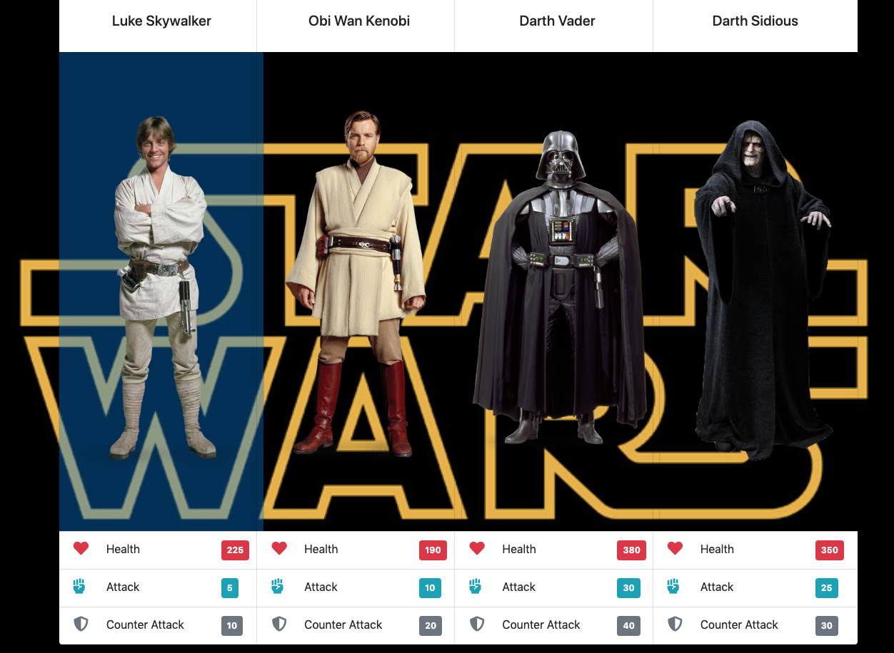

# Star Wars RPG

## About

Role playing game somewhere in a galaxy far far away.

## Getting Started

1.  Select player.
2.  Select opponent.
3.  Once in their fighting positions, click "Attack"
4.  As you trade blows your "Attack" will increase while your "Health" decreases.
5.  If you defeat your opponent, the opponent card will disappear.
6.  Repeat from step #2 until no opponents remain.

## Technologies

Built using using core front-end technologies. Basic structure using HTML5. Layout and styling done with Bootstrap4's grid system and CSS3. Functionality is written with a combination of jQuery and vanilla JavaScript.

- HTML5
- CSS3
  - Bootstrap4
- JavaScript
  - jQuery

## Author

[Mike Hume](https://mahume.github.io/)
